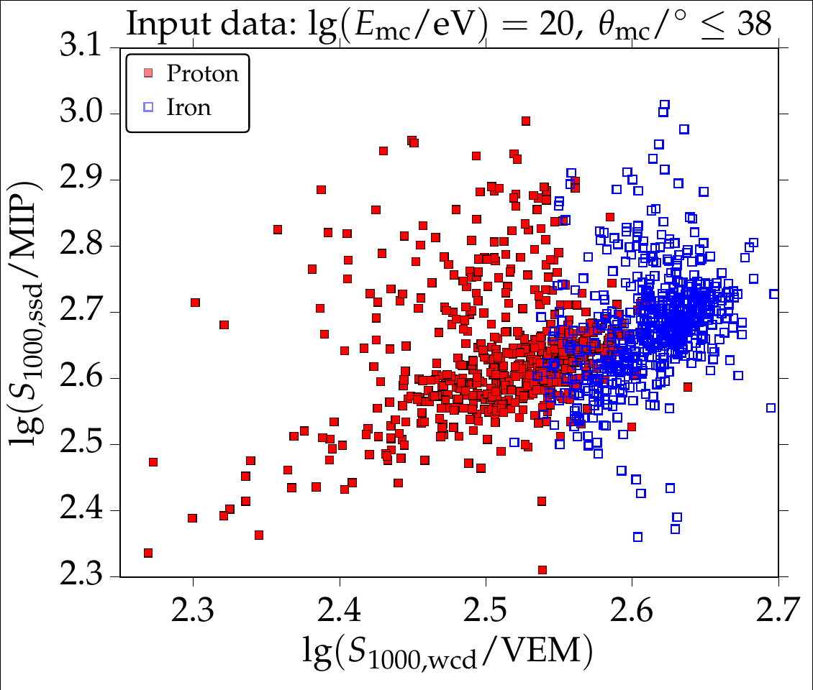

# sklearn_analysis
Code used to perform LDA and PCA Analysis with Scikit-learn using data from ultra-high-energy cosmic rays.

# Introduction
Cosmic rays are ionized nuclei produced by astrophysical sources where they can be accelerated up to energies of $10^{21}~\mathrm{eV}$, being the most energetic particles observed in the Universe. These particles travel long distances through the intergalactic medium until they reach the Earth's atmosphere. Since they are very energetic particles, they rapidly intereact with the nuclei of the atmosphere producing the so-called _extensive air showers_, or a cascade of secondary particles which propagate to te ground where they can be measured.

The main goal is to measure both the **energy** and the **chemical composition** of the primary particle that hit the atmosphere. For this purpose, large arrays of ground-based detectors are built to measure cosmic rays showers. An example of such facility is the [Pierre Auger Observatory](https://www.auger.org/).

# Data set

For this analysis, we use data from Monte Carlo simulations of air showers being detected by two types of detectors at the Pierre Auger Observatory. The dataset is composed of four pieces of information:
- Logarithmic energy of the primary cosmic ray: $\log_{10}(E / \mathrm{eV})$
- Logarithmic atomic mass number of the primary cosmic ray: $\ln(A)$
- Arrival direction or zenith angle of the primary cosmic ray: $\theta$
- Signals of Water-Cherenkov Detectors ($S_\mathrm{WCD}$) and Scintillator Surface Detectors ($S_\mathrm{SSD}$) produced by shower particles

An example of the input data used for the analysis is shown in the figure below:

Each point corresponds with an _event_ of $10^{20}~\mathrm{eV}$ of energy and zenith angles below $38^\circ$. The _x_-axis is the reconstructed signal at 1000 m to the shower core using Water Cherenkov Detectors (WCD) and the _y_-axis the corresponding signal using Scintillator Surface Detectors (SSD). Using two detectors of different characteristics may help us to separate events of two different particles, in this case proton ($A = 1$) and iron ($A = 56$). 

